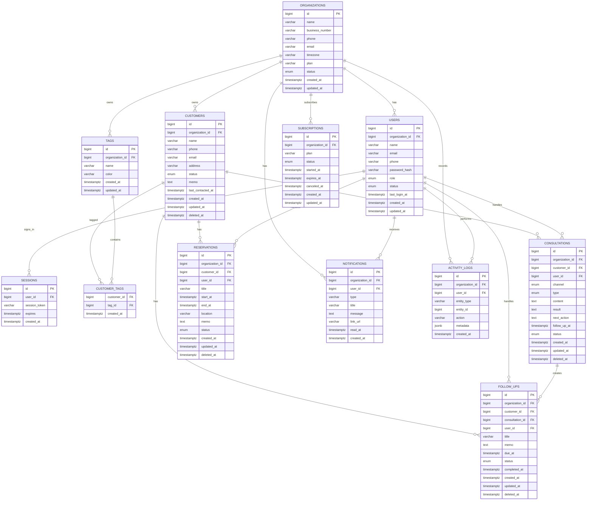

# CustomerFlow MVP — DB ERD & Database Specification

## 1. Database Principles

- DB: PostgreSQL 18 계열 권장
- ORM/Migration: Prisma ORM
- Runtime timezone: DB 저장은 UTC, 화면 표시는 `Asia/Seoul`
- Multi-tenant: 모든 업무 데이터에 `organization_id` 적용
- Soft delete가 필요한 핵심 데이터는 `deleted_at` 사용
- 금액은 `numeric(12,2)` 또는 Prisma `Decimal` 사용
- 모든 FK에는 조회 패턴에 맞는 인덱스 적용
- 클라이언트가 보낸 `organization_id`는 저장/조회 조건으로 사용하지 않는다.

MySQL/MariaDB는 대체 가능하지만 MVP 기본 문서는 PostgreSQL + Prisma 기준으로 작성한다.

## 2. ERD



## 3. Prisma Schema Draft

```prisma
generator client {
  provider = "prisma-client-js"
}

datasource db {
  provider = "postgresql"
  url      = env("DATABASE_URL")
}

enum UserRole {
  owner
  admin
  staff
}

enum UserStatus {
  active
  invited
  suspended
}

enum OrganizationStatus {
  active
  suspended
}

enum CustomerStatus {
  new
  consulting
  reserved
  completed
  dormant
  cancelled
}

enum ConsultationChannel {
  phone
  sms
  kakao
  danggeun
  visit
  other
}

enum ConsultationType {
  inquiry
  quote
  booking
  complaint
  returning
  other
}

enum ConsultationStatus {
  new
  consulting
  quote
  reserved
  completed
  on_hold
  cancelled
}

enum ReservationStatus {
  scheduled
  in_progress
  completed
  cancelled
  no_show
}

enum FollowUpStatus {
  pending
  completed
  cancelled
}

enum SubscriptionStatus {
  trial
  active
  past_due
  canceled
  expired
}

model Organization {
  id             BigInt             @id @default(autoincrement())
  name           String             @db.VarChar(120)
  businessNumber String?            @unique @map("business_number") @db.VarChar(30)
  phone          String?            @db.VarChar(30)
  email          String?            @db.VarChar(255)
  timezone       String             @default("Asia/Seoul") @db.VarChar(50)
  plan           String             @default("free") @db.VarChar(30)
  status         OrganizationStatus @default(active)
  createdAt      DateTime           @default(now()) @map("created_at") @db.Timestamptz(6)
  updatedAt      DateTime           @updatedAt @map("updated_at") @db.Timestamptz(6)

  users          User[]
  customers      Customer[]
  tags           Tag[]
  consultations  Consultation[]
  reservations   Reservation[]
  followUps      FollowUp[]
  notifications  Notification[]
  subscriptions  Subscription[]
  activityLogs   ActivityLog[]

  @@map("organizations")
}

model User {
  id             BigInt       @id @default(autoincrement())
  organizationId BigInt       @map("organization_id")
  name           String       @db.VarChar(80)
  email          String       @unique @db.VarChar(255)
  phone          String?      @db.VarChar(30)
  passwordHash   String       @map("password_hash") @db.VarChar(255)
  role           UserRole     @default(staff)
  status         UserStatus   @default(active)
  lastLoginAt    DateTime?    @map("last_login_at") @db.Timestamptz(6)
  createdAt      DateTime     @default(now()) @map("created_at") @db.Timestamptz(6)
  updatedAt      DateTime     @updatedAt @map("updated_at") @db.Timestamptz(6)

  organization   Organization @relation(fields: [organizationId], references: [id])
  sessions       Session[]
  consultations  Consultation[]
  reservations   Reservation[]
  followUps      FollowUp[]
  notifications  Notification[]
  activityLogs   ActivityLog[]

  @@index([organizationId])
  @@map("users")
}

model Session {
  id           BigInt   @id @default(autoincrement())
  userId       BigInt   @map("user_id")
  sessionToken String   @unique @map("session_token") @db.VarChar(255)
  expires      DateTime @db.Timestamptz(6)
  createdAt    DateTime @default(now()) @map("created_at") @db.Timestamptz(6)

  user         User     @relation(fields: [userId], references: [id], onDelete: Cascade)

  @@index([userId])
  @@map("sessions")
}

model Customer {
  id              BigInt         @id @default(autoincrement())
  organizationId  BigInt         @map("organization_id")
  name            String         @db.VarChar(120)
  phone           String?        @db.VarChar(30)
  email           String?        @db.VarChar(255)
  address         String?        @db.VarChar(500)
  status          CustomerStatus @default(new)
  memo            String?
  lastContactedAt DateTime?      @map("last_contacted_at") @db.Timestamptz(6)
  createdAt       DateTime       @default(now()) @map("created_at") @db.Timestamptz(6)
  updatedAt       DateTime       @updatedAt @map("updated_at") @db.Timestamptz(6)
  deletedAt       DateTime?      @map("deleted_at") @db.Timestamptz(6)

  organization    Organization   @relation(fields: [organizationId], references: [id])
  tags            CustomerTag[]
  consultations   Consultation[]
  reservations    Reservation[]
  followUps       FollowUp[]

  @@index([organizationId, createdAt])
  @@index([organizationId, status])
  @@index([organizationId, phone])
  @@index([organizationId, name])
  @@map("customers")
}

model Tag {
  id             BigInt        @id @default(autoincrement())
  organizationId BigInt        @map("organization_id")
  name           String        @db.VarChar(50)
  color          String?       @db.VarChar(20)
  createdAt      DateTime      @default(now()) @map("created_at") @db.Timestamptz(6)
  updatedAt      DateTime      @updatedAt @map("updated_at") @db.Timestamptz(6)

  organization   Organization  @relation(fields: [organizationId], references: [id])
  customers      CustomerTag[]

  @@unique([organizationId, name])
  @@index([organizationId])
  @@map("tags")
}

model CustomerTag {
  customerId BigInt   @map("customer_id")
  tagId      BigInt   @map("tag_id")
  createdAt  DateTime @default(now()) @map("created_at") @db.Timestamptz(6)

  customer   Customer @relation(fields: [customerId], references: [id], onDelete: Cascade)
  tag        Tag      @relation(fields: [tagId], references: [id], onDelete: Cascade)

  @@id([customerId, tagId])
  @@index([tagId])
  @@map("customer_tags")
}

model Consultation {
  id             BigInt              @id @default(autoincrement())
  organizationId BigInt              @map("organization_id")
  customerId     BigInt              @map("customer_id")
  userId         BigInt?             @map("user_id")
  channel        ConsultationChannel @default(other)
  type           ConsultationType    @default(inquiry)
  content        String
  result         String?
  nextAction     String?             @map("next_action")
  followUpAt     DateTime?           @map("follow_up_at") @db.Timestamptz(6)
  status         ConsultationStatus  @default(new)
  createdAt      DateTime            @default(now()) @map("created_at") @db.Timestamptz(6)
  updatedAt      DateTime            @updatedAt @map("updated_at") @db.Timestamptz(6)
  deletedAt      DateTime?           @map("deleted_at") @db.Timestamptz(6)

  organization   Organization        @relation(fields: [organizationId], references: [id])
  customer       Customer            @relation(fields: [customerId], references: [id])
  user           User?               @relation(fields: [userId], references: [id], onDelete: SetNull)
  followUps      FollowUp[]

  @@index([organizationId, createdAt])
  @@index([customerId, createdAt])
  @@index([organizationId, followUpAt])
  @@map("consultations")
}

model Reservation {
  id             BigInt            @id @default(autoincrement())
  organizationId BigInt            @map("organization_id")
  customerId     BigInt            @map("customer_id")
  userId         BigInt?           @map("user_id")
  title          String            @db.VarChar(200)
  startAt        DateTime          @map("start_at") @db.Timestamptz(6)
  endAt          DateTime          @map("end_at") @db.Timestamptz(6)
  location       String?           @db.VarChar(500)
  memo           String?
  status         ReservationStatus @default(scheduled)
  createdAt      DateTime          @default(now()) @map("created_at") @db.Timestamptz(6)
  updatedAt      DateTime          @updatedAt @map("updated_at") @db.Timestamptz(6)
  deletedAt      DateTime?         @map("deleted_at") @db.Timestamptz(6)

  organization   Organization      @relation(fields: [organizationId], references: [id])
  customer       Customer          @relation(fields: [customerId], references: [id])
  user           User?             @relation(fields: [userId], references: [id], onDelete: SetNull)

  @@index([organizationId, startAt])
  @@index([customerId, startAt])
  @@map("reservations")
}

model FollowUp {
  id             BigInt         @id @default(autoincrement())
  organizationId BigInt         @map("organization_id")
  customerId     BigInt         @map("customer_id")
  consultationId BigInt?        @map("consultation_id")
  userId         BigInt?        @map("user_id")
  title          String         @db.VarChar(200)
  memo           String?
  dueAt          DateTime       @map("due_at") @db.Timestamptz(6)
  status         FollowUpStatus @default(pending)
  completedAt    DateTime?      @map("completed_at") @db.Timestamptz(6)
  createdAt      DateTime       @default(now()) @map("created_at") @db.Timestamptz(6)
  updatedAt      DateTime       @updatedAt @map("updated_at") @db.Timestamptz(6)
  deletedAt      DateTime?      @map("deleted_at") @db.Timestamptz(6)

  organization   Organization   @relation(fields: [organizationId], references: [id])
  customer       Customer       @relation(fields: [customerId], references: [id])
  consultation   Consultation?  @relation(fields: [consultationId], references: [id], onDelete: SetNull)
  user           User?          @relation(fields: [userId], references: [id], onDelete: SetNull)

  @@index([organizationId, dueAt, status])
  @@index([customerId])
  @@map("follow_ups")
}

model Notification {
  id             BigInt       @id @default(autoincrement())
  organizationId BigInt       @map("organization_id")
  userId         BigInt       @map("user_id")
  type           String       @db.VarChar(50)
  title          String       @db.VarChar(200)
  message        String
  linkUrl        String?      @map("link_url") @db.VarChar(500)
  readAt         DateTime?    @map("read_at") @db.Timestamptz(6)
  createdAt      DateTime     @default(now()) @map("created_at") @db.Timestamptz(6)

  organization   Organization @relation(fields: [organizationId], references: [id])
  user           User         @relation(fields: [userId], references: [id], onDelete: Cascade)

  @@index([userId, readAt, createdAt])
  @@map("notifications")
}

model Subscription {
  id             BigInt             @id @default(autoincrement())
  organizationId BigInt             @map("organization_id")
  plan           String             @db.VarChar(30)
  status         SubscriptionStatus @default(trial)
  startedAt      DateTime           @map("started_at") @db.Timestamptz(6)
  expiresAt      DateTime?          @map("expires_at") @db.Timestamptz(6)
  canceledAt     DateTime?          @map("canceled_at") @db.Timestamptz(6)
  createdAt      DateTime           @default(now()) @map("created_at") @db.Timestamptz(6)
  updatedAt      DateTime           @updatedAt @map("updated_at") @db.Timestamptz(6)

  organization   Organization       @relation(fields: [organizationId], references: [id])

  @@index([organizationId])
  @@map("subscriptions")
}

model ActivityLog {
  id             BigInt       @id @default(autoincrement())
  organizationId BigInt       @map("organization_id")
  userId         BigInt?      @map("user_id")
  entityType     String       @map("entity_type") @db.VarChar(50)
  entityId       BigInt?      @map("entity_id")
  action         String       @db.VarChar(50)
  metadata       Json?
  createdAt      DateTime     @default(now()) @map("created_at") @db.Timestamptz(6)

  organization   Organization @relation(fields: [organizationId], references: [id])
  user           User?        @relation(fields: [userId], references: [id], onDelete: SetNull)

  @@index([organizationId, createdAt])
  @@index([entityType, entityId])
  @@map("activity_logs")
}
```

Auth.js database session을 위해 `sessions` 테이블을 둔다. OAuth 또는 email sign-in을 추가할 때는 Auth.js adapter 요구사항에 맞춰 `accounts`, `verification_tokens` 등 provider 관련 테이블을 추가한다.

## 4. PostgreSQL DDL Reference

Prisma migrations are the source of truth. The SQL below is a reference for DB review and manual inspection.

```sql
CREATE TYPE user_role AS ENUM ('owner', 'admin', 'staff');
CREATE TYPE user_status AS ENUM ('active', 'invited', 'suspended');
CREATE TYPE organization_status AS ENUM ('active', 'suspended');
CREATE TYPE customer_status AS ENUM ('new', 'consulting', 'reserved', 'completed', 'dormant', 'cancelled');
CREATE TYPE consultation_channel AS ENUM ('phone', 'sms', 'kakao', 'danggeun', 'visit', 'other');
CREATE TYPE consultation_type AS ENUM ('inquiry', 'quote', 'booking', 'complaint', 'returning', 'other');
CREATE TYPE consultation_status AS ENUM ('new', 'consulting', 'quote', 'reserved', 'completed', 'on_hold', 'cancelled');
CREATE TYPE reservation_status AS ENUM ('scheduled', 'in_progress', 'completed', 'cancelled', 'no_show');
CREATE TYPE follow_up_status AS ENUM ('pending', 'completed', 'cancelled');
CREATE TYPE subscription_status AS ENUM ('trial', 'active', 'past_due', 'canceled', 'expired');

CREATE TABLE organizations (
  id BIGSERIAL PRIMARY KEY,
  name VARCHAR(120) NOT NULL,
  business_number VARCHAR(30) UNIQUE,
  phone VARCHAR(30),
  email VARCHAR(255),
  timezone VARCHAR(50) NOT NULL DEFAULT 'Asia/Seoul',
  plan VARCHAR(30) NOT NULL DEFAULT 'free',
  status organization_status NOT NULL DEFAULT 'active',
  created_at TIMESTAMPTZ NOT NULL DEFAULT now(),
  updated_at TIMESTAMPTZ NOT NULL DEFAULT now()
);

CREATE TABLE users (
  id BIGSERIAL PRIMARY KEY,
  organization_id BIGINT NOT NULL REFERENCES organizations(id),
  name VARCHAR(80) NOT NULL,
  email VARCHAR(255) NOT NULL UNIQUE,
  phone VARCHAR(30),
  password_hash VARCHAR(255) NOT NULL,
  role user_role NOT NULL DEFAULT 'staff',
  status user_status NOT NULL DEFAULT 'active',
  last_login_at TIMESTAMPTZ,
  created_at TIMESTAMPTZ NOT NULL DEFAULT now(),
  updated_at TIMESTAMPTZ NOT NULL DEFAULT now()
);

CREATE INDEX idx_users_org ON users (organization_id);

CREATE TABLE sessions (
  id BIGSERIAL PRIMARY KEY,
  user_id BIGINT NOT NULL REFERENCES users(id) ON DELETE CASCADE,
  session_token VARCHAR(255) NOT NULL UNIQUE,
  expires TIMESTAMPTZ NOT NULL,
  created_at TIMESTAMPTZ NOT NULL DEFAULT now()
);

CREATE INDEX idx_sessions_user ON sessions (user_id);
```

핵심 테이블 전체 DDL은 Prisma schema에서 생성한다. 수동 SQL을 유지하면 Prisma schema와 충돌할 수 있으므로 `prisma migrate dev`와 migration SQL을 기준으로 관리한다.

## 5. Tenant Isolation Rules

1. 인증된 사용자의 `organizationId`를 서버 세션에서 확정한다.
2. 클라이언트가 전달한 `organizationId` 또는 `organization_id`는 무시한다.
3. 모든 조회/수정/삭제에 organization scope를 강제한다.
4. `GET /api/customers/123`도 `where: { id: 123, organizationId: currentOrgId, deletedAt: null }` 형태로 조회한다.
5. 다른 사업장의 ID를 추측해도 데이터가 반환되지 않아야 한다.
6. tenant isolation 실패는 기본적으로 `404 NOT_FOUND`를 반환한다.
7. 권한 검사는 Route Handler뿐 아니라 service/repository 계층에서도 수행한다.
8. `customer_tags` 생성 시 customer와 tag가 모두 현재 organization에 속하는지 트랜잭션 안에서 검증한다.

## 6. Initial Seed

- 테스트 조직 1개
- owner 계정 1개
- staff 계정 1개
- 테스트 고객 5개
- 테스트 상담 5개
- 테스트 예약 3개
- 테스트 후속관리 3개
- 태그 5개

실제 비밀번호는 소스에 하드코딩하지 않고 seed 실행 시 환경변수 또는 개발 전용 fixture에서 해시한다.
